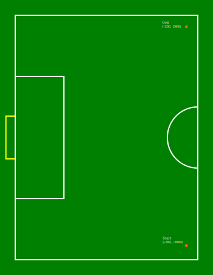
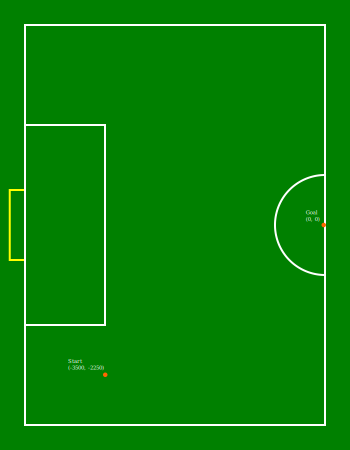
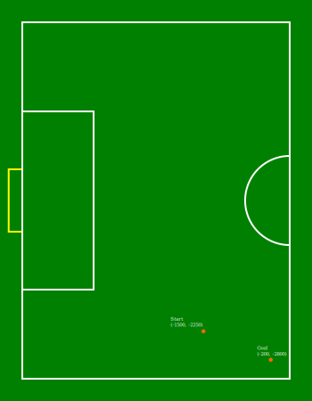
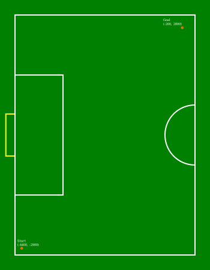
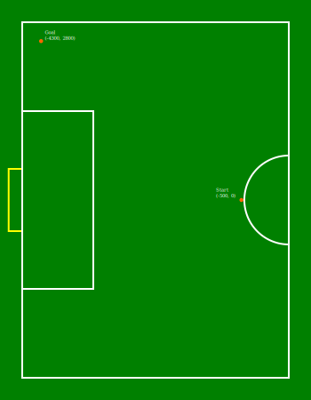
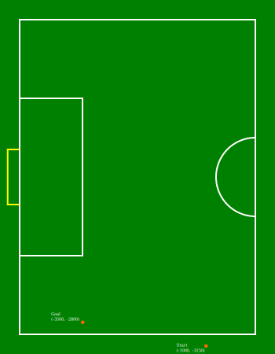
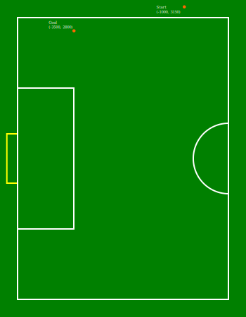
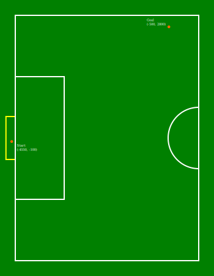

:source-highlighter: highlightjs

= RoboCup 2022 SSL Ball Placement Technical Challenge Rules
{docdate}
:toc:
:sectnumlevels: 0

// add icons from fontawesome in a up-to-date version
ifdef::backend-html5[]
++++
<link rel="stylesheet" href="https://use.fontawesome.com/releases/v5.3.1/css/all.css" integrity="sha384-mzrmE5qonljUremFsqc01SB46JvROS7bZs3IO2EmfFsd15uHvIt+Y8vEf7N7fWAU" crossorigin="anonymous">
++++
endif::backend-html5[]

:icons: font
:numbered:

NOTE: References to the male gender in the rules with respect to referees, team
members, officials, etc. are for simplification and apply to both males and
females.

== Goals of the Technical Challenge

Given the goal of preparing Division B teams to participate in Division A, this
technical challenge aims to incentive Division B teams to develop one of the
skills needed to play a match in Division A. In this case, the challenge is to
autonomously place the ball using the robots ("*AutoPlacement*").

=== Participation Requirements

All Division B teams are eligible and *must* participate in this challenge.

== Procedure

The Ball Placement Technical Challenge will be executed using the Game Controller manual controls. Therefore, the procedure is as
follows:

* The Game Controller, SSL Vision and at least one Auto Referee must be already
  running
* Make sure the game state is First Half or Second Half
* The desired position must be set in Game Controller
* The ball must be placed at the indicated position
* The robot(s) must be placed on the middle line of the field
* When all positions are correct, the challenge will start
* A *Stop* command will be issued for *2 seconds*
* Then, the *AutoPlacement* command will be issued

The AutoPlacement command includes a *game state*, which will be
*BallPlacementBlue*, and the requested ball position. Before and after those
commands the game is in Stop state, therefore, the robots are allowed to
position themselves wherever they want before the placement starts, while
following all Stop state rules.

The rules for the AutoPlacement can be found in the
link:https://robocup-ssl.github.io/ssl-rules/sslrules.html#_ball_placement[rule book].

The starting and desired positions of the ball can be seen in the Appendix at
the end of the document. The "Start" is the starting position, and the
"Goal" is the position where the ball must be placed.

In scenarios 6 and 7, the ball must be placed with an **Y** value, such that
the robot cannot get between the ball and the wall.

*Teams are allowed to use up to 6 robots*.

== Evaluation

Every team places the ball in the same scenarios and has 30 minutes to complete all scenarios. The 30 minutes considers the time for completing the challenges and the time for setting up the scenarios, like positioning the ball each try. There are no restrictions on the quantity of tries per scenario, since each team has your strategy to complete the challenge within the time.

In total, there will be *8 scenarios* in this challenge. The order of the
scenarios will be chosen by the team before the challenge begins, communicating the order for the TC.

=== Scoring

For every scenario, the following criterias will be evaluated.

* Touching the ball with the dribbler -- +1
* Moving the ball more than 1 meter away from the starting position -- +1
* Completing the ball placement -- +1
* Completing the ball placement in less than 30 seconds -- +1
* The ball, when the challenge is finished, is less than 1 meter away from the desired position -- +1

For the scenarios 6, 7 and 8, there will a additional criteria for taking the ball from the boundary.

* Taking the ball out from the boundary -- +1

The points will be counted one time per scenario. For example, if the robot touches the ball with the dribbler both tries, only 1 point will be given for the team in this scenario.

The partial points of each scenario will be summed. In case of ties, the team that was capable of placing the balls in the least amount of tries wins.

The TC reserves the right to change the evaluation procedure.

[appendix]

== Scenarios for Ball Placement

=== Scenario 1

[source,json]
----
include::ball_placement_scenarios/bptcsc1.json[]
----

=== Scenario 2

[source,json]
----
include::ball_placement_scenarios/bptcsc2.json[]
----

=== Scenario 3

[source,json]
----
include::ball_placement_scenarios/bptcsc3.json[]
----

=== Scenario 4

[source,json]
----
include::ball_placement_scenarios/bptcsc4.json[]
----

=== Scenario 5

[source,json]
----
include::ball_placement_scenarios/bptcsc5.json[]
----

=== Scenario 6

[source,json]
----
include::ball_placement_scenarios/bptcsc6.json[]
----

=== Scenario 7

[source,json]
----
include::ball_placement_scenarios/bptcsc7.json[]
----

=== Scenario 8

[source,json]
----
include::ball_placement_scenarios/bptcsc8.json[]
----

