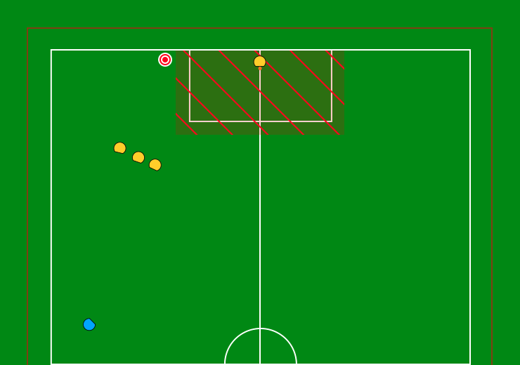

:source-highlighter: highlightjs

= RoboCup 2025 Obstacle Avoidance Challenge
{docdate}
:toc:
:stem: latexmath
:sectnumlevels: 0

// add icons from fontawesome in a up-to-date version
ifdef::backend-html5[]
++++
<link rel="stylesheet" href="https://use.fontawesome.com/releases/v5.3.1/css/all.css" integrity="sha384-mzrmE5qonljUremFsqc01SB46JvROS7bZs3IO2EmfFsd15uHvIt+Y8vEf7N7fWAU" crossorigin="anonymous">
++++
endif::backend-html5[]

:icons: font
:numbered:

NOTE: References to the male gender in the rules with respect to referees, team
members, officials, etc., are for simplification and apply to both males and
females.

== Goal of the Technical Challenge
Obstacles are a central part in high level SSL matches. They can be defined directly by the rules (e.g. _Rule 8.4.1 Robot Too Close To Opponent Defense Area_), by the rules in combination with other factors like the position of the ball (e.g. _Rule 8.4.3 Defender Too Close To Ball_) or other robots (see, Crashing), or result from strategic robot positioning (e.g., for blocking or coordination).

However, obstacle avoidance - especially with moving obstacles - is a hard task. In Division B, many of the rules that force obstacle avoidance can often be ignored: Crashes are not penalized if the robot is driving slowly; Ball placement is optional; and rules like _Rule 8.4.1 Robot Too Close To Opponent Defense Area_ are often ignored by teams, and regularly cause long interruptions in matches when the autoref (correctly!) detects infractions.

This technical challenge incentivizes teams in Division B to work on both their implementation of rule-based obstacles and their obstacle avoidance.

=== Participation Requirements
All Division B teams are eligible and *encouraged* to participate in this challenge. Teams who have previously participated in Division A are ineligible and cannot participate. 

== Procedure
=== General
This technical challenge contains multiple scenarios, published in roughly ascending order of difficulty on the first setup day. This is intended to incentivize the implementation of generalized obstacle avoidance rather than pre-scripted solutions. Two unused example scenarios are appended to this document.

Obstacles may include:
* The opponent *defense area* plus a 0.2m buffer (see _Rule 8.4.1 Robot Too Close To Opponent Defense Area_).
* A *ball placement line* plus a 0.5m buffer (see _8.4.3 Ball Placement Interference_).
* The *opponent robots* (some of which might be moving in a preprogrammed pattern, up to 1.0 m/s).
* *Virtual lines* between two robots, which must not be crossed.

Each team is allowed up to three trials for each scenario. Only the best-scoring trial per scenario is counted. Each trial has a time limit of 30 seconds. There are 30 minutes per participating team. Teams have to manage this time themselves, and can allocate the time freely - including but not limited to spending it on debugging software or fixing robots, in addition to the actual trials. Be advised that the number of scenarios (with three trials each) is designed in a way that roughly takes up the full 30 minutes.

=== Procedure of a trial

* The Game Controller, a vision software, and at least one slightly modified autoref (see below) have to be running.
* The game stage is _FIRST HALF_ or _SECOND HALF_.
* The participating team plays using a single *blue* robot. A non-participating team provides and controls the *yellow* robots, which act as obstacles.
* The challenge is conducted on one half of a Division B field, specifically the half containing the yellow goal, located on the field's negative x-axis.
* A _STOP_ command is issued to begin setup.
* Once all robots and the ball are positioned, the referee or AutoRef issues the _BALL_PLACEMENT_YELLOW_ command. This marks the beginning of the 30-second trial timer.
* The participating robot must navigate to the fixed target coordinate (-4350, -1350).
* During the trial, the participating robot has to abide by all the rules that are in effect during the game state _BALL PLACEMENT_ and the special rule set defined for this challenge.
* A trial ends when either:
 * The robot reaches the target (defined as the robot’s center being within 7 cm of the target position). There are no velocity requirements for reaching the target.
 * 30 seconds have elapsed.
 * The robot violates any obstacle constraint (detected via _BOT_CRASH_, _BOT_INTERFERED_PLACEMENT_, _ATTACKER_TOO_CLOSE_TO_DEFENSE_AREA_, or by human referee decision).

=== Special Rule Set during the Technical Challenge
For this Technical Challenge, the normal SSL rules apply, with the following exceptions:

* _Rule 8.4.1 Robot Too Close To Opponent Defense Area_ also applies during the game state BALL_PLACEMENT even though it ordinarily only applies to the game state STOP.
* _Rule 8.4.2 Crashing_ will apply to any collision of two opposing robots, irrespective of their velocities.
* _Rule 8.4.1 Robot Too Close To Opponent Defense Area_ and _Rule 8.4.3 Ball Placement Interference_ have their grace periods removed.

The Technical Committee will supply an accordingly modified Game Controller and Autoref.

== Evaluation
=== Trial evaluation
Each trial is scored based on the remaining time (in seconds) when the robot reaches the target. If the robot fails to reach the target within 30 seconds or violates any rule, the trial score is zero.

=== Scenario evaluation
For each scenario, a team's scenario score is the highest trial score achieved across its three attempts. If a team does not attempt a scenario, the scenario score is zero by default. Teams are ranked based on their scenario scores. The team with the highest score receives rank 1, the next highest rank 2, and so on. A lower numerical rank is better. In the event of a tie, all tied teams share the numerically higher rank.

=== Challenge evaluation
A team’s final challenge score is the sum of its scenario ranks. The team with the lowest
challenge score (i.e., the best ranks across scenarios) wins. In case of a tie, the team with the
higher total of scenario scores (i.e., total remaining time across all scenarios) is declared the
winner.

