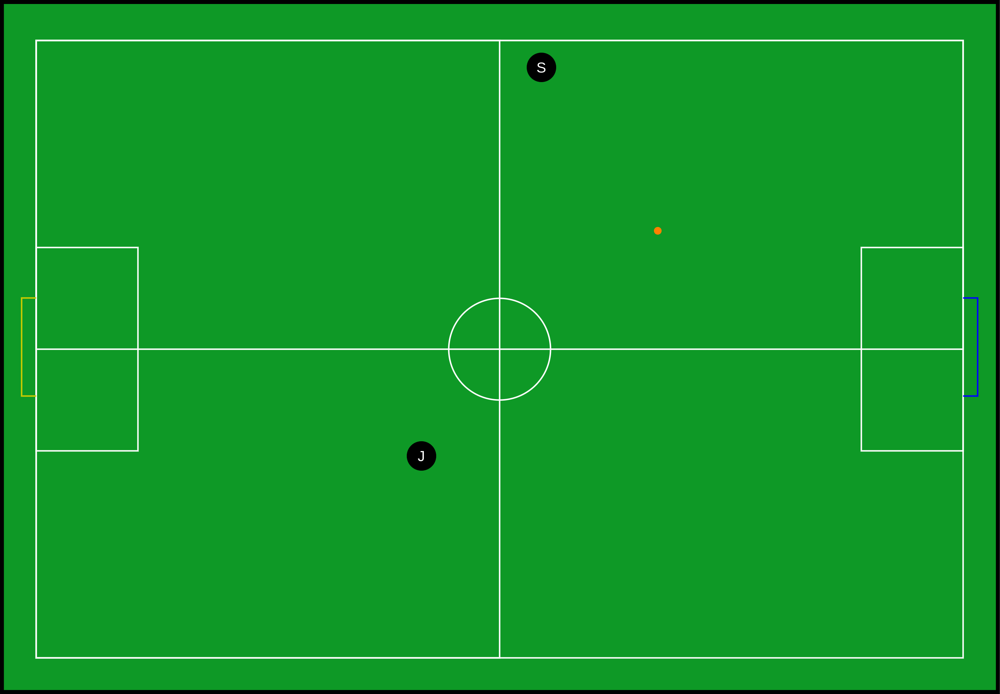

:source-highlighter: highlightjs

= RoboCup 2026 SSL RCJ Soccer Junior Cooperation Challenge
{docdate}
:toc:
:stem: latexmath
:sectnumlevels: 0

// add icons from fontawesome in a up-to-date version
ifdef::backend-html5[]
++++
<link rel="stylesheet" href="https://use.fontawesome.com/releases/v5.3.1/css/all.css" integrity="sha384-mzrmE5qonljUremFsqc01SB46JvROS7bZs3IO2EmfFsd15uHvIt+Y8vEf7N7fWAU" crossorigin="anonymous">
++++
endif::backend-html5[]

:icons: font
:numbered:

NOTE: References to the male gender in the rules with respect to referees, team members, officials, etc., are for simplification and apply to both males and females.

The goal of this year's challenge is for the Junior and major team to score a goal together as fast as possible. To count as a valid goal both teams must have touched the ball before it is shot into the goal. Also during the try no rule should be violated, since otherwise the number of collected points with this attempt will be reduced. If multiple teams end up with the same amount of points, be aware of the tie-breaker.

=== General

Each team pairing is allocated five official attempts and a total session time of 20 minutes. During this period, teams may make modifications to their software or hardware and perform unscored test runs.
The scores from the best three of the up to five official attempts will be added together to determine the team's final score.
Each official attempt must be announced to the officials before it begins.
In the event that two teams achieve the same final score, the fastest individual run time among their scoring attempts will be used as the tie-breaker.
In case of that not being sufficient, first the second and then the third fastest times of the scoring attempts will be compared. To calculate the time per run, the time of the Force Start event and the ending event are compared with each other. To reduce issues of various latency in the event detection the official run times are rounded to 100ms accuracy.

=== Testing
Aside from the time during the challenge itself there will be no dedicated testing slots as part of this challenge. To allow for testing, each competing pairing can use testslots from the SSL team.

In case the availability of the SSL fields allows it, the SSL teams participating in the Tech Challenge will get an additional test slot under the expectation that the additional time will be solely used for shared tests together with juniors. In case this expectation is not fulfilled disciplinary measures can be taken.

===  Setup

The Technical Challenge will take place on a full size Div B field, which has no modification besides the goals being colored in blue and yellow on the inside as in the Junior Leagues. As an orange ball the Junior Infrared ball will be used and the pairing will play as the yellow team scoring against the blue goal.

With that the setup of the challenge start could look as following:

[[field-dimensions-a]]
.Field dimensions and markings for division A

=== Procedure
1. Before the start of the trial both participating teams have to place one of their robots inside the yellow half. The Junior Bot needs to be placed 1meter aside the outer line and half a meter aside the middle line. The Major Bot needs to be placed one meter ahead of the far corner of the yellow defense box. The ball is placed by the judges at the penalty mark of the blue goal.
2. To start the run the GC will send a Force Start Command and the timer for the trial will also be started.
3. First, the Junior bot has to stay still until the SSL touches the ball and shoots it.
4. Now the Junior robot must shoot the ball into the blue goal.
5. The try ends after a scored goal or after 30 seconds.

For every successful task during the challenge the pair will get the following points which add up per condition that applies:

- Junior Robot touching the ball +6P
-  Junior Robot touching the ball inside the blue field half + 4P
-  Junior Robot shooting the ball into the penalty-area of the blue goal +6P
- Junior Robot scoring a goal + 10P
- the challenge is completed in <=15 sec +10P
-  the challenge is completed in <=20 sec +10P

In case the following rules get violated the following points will be deducted for the try. A try cannot have a negative number of points:

- a robot has been touched by a human during the trial -4P
- the procedure is done in the incorrect order -4P
- the start position differs more then one robot radius -1P per robot and robot radius
- any other rule of the following ruleset is violated -1P

=== Ruleset

During the Tech Challenge the following rules apply:

- No robot can drive into the defense area
- Chip Kicks (higher than 10cm above ground level) are strictly forbidden and lead to a disqualification of the conducting team
- The max ball speed is reduced to 3.5 m/s
- The robots can not exceed a speed of 2.5 m/s

Except for the adaptations described above, the *SSL Division B Ruleset* shall apply in its entirety.

=== Evaluation

To evaluate each attempt at least one member of the Junior Soccer Committees, as well as the SSL committees have to be present. To reduce biases the judging members can not have any affiliation with the teams that evaluated in the trial.

The code responsible for communication and for distinguishing the penalty white line from other white lines must be released as an open-source release. This is mandatory for junior bots but strongly advised for major.  This is mandatory for junior bots but strongly advised for major.  There is no requirement to open-source the entire robot legacy codebase, although teams are welcome to do so.

Additionally, teams are encouraged to provide a diagram or other documentation explaining the logic used for white line differentiation.

Submission of this open-source release is a prerequisite for eligibility in the final competition ranking.
